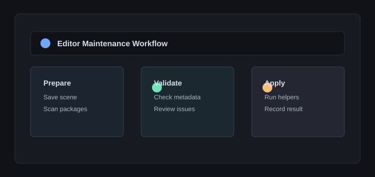

# Unity Workflow Tools

Unity Workflow Tools 是用于验证 Locus 插件 Hub 多语言详情的测试插件。它模拟 Unity 编辑器日常维护流程，把检查清单、自动化说明和预览图作为中文详情内容展示。

## 使用场景

- 保存场景并扫描包元数据
- 检查插件清单与兼容性字段
- 运行重复性的编辑器辅助命令
- 记录执行结果，便于后续排查

## 测试矩阵

| 能力 | 测试目的 |
| --- | --- |
| 清单渲染 | 验证中文列表间距 |
| 相对 SVG 预览 | 验证 Markdown 图片 URL 重写 |
| 外部 icon | 列表 icon 仍来自 `icon.svg` |
| 代码块 | 验证详情页紧凑代码样式 |

~~~ts
export async function runWorkflow() {
  await saveScene();
  await validatePackages();
  return recordResult("ok");
}
~~~

这个仓库只承载测试插件源码和说明文件，插件包通过 release 或仓库归档下载。
